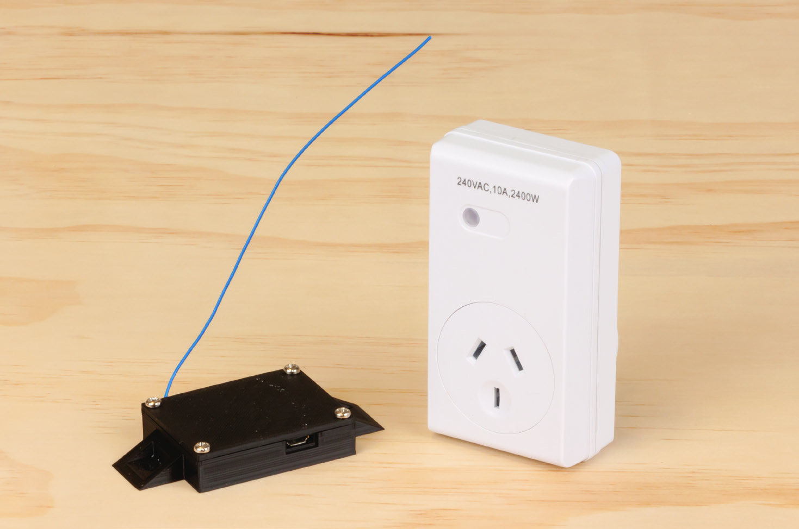

# WiFi Mains Switch

<github>View how this project is meant to be displayed at https://jaycar.com.au/wifi-mains-switch</github>

Control one or multiple power points with our IoT WiFi Power Switch Project



We can easily set our power points to turn on or off when we have left the house, during certain times of the day, or using a button widget on our phone. Thanks to the power of IFTTT we can also configure it to connected to anything else, such as if we receive an email on our gmail account or when we get a phone call. The sky's the limit!

We also have a neat 3D printed box that is included in this project, which you can play around with.

<stl>model/case.stl</stl>

Download and print out this case yourself!

This is an update on our WiFi controller project, which makes it a lot more simpler to make and configure, as well as open up the possibilities to what is available.

- [WiFi Mains Switch](#WiFi-Mains-Switch)
  - [Bill of materials](#Bill-of-materials)
    - [You might also want](#You-might-also-want)
    - [Tools required](#Tools-required)
  - [System Overview](#System-Overview)
  - [Assembly](#Assembly)
    - [Setting up the services](#Setting-up-the-services)
      - [Adafruit IO](#Adafruit-IO)
      - [IFTTT](#IFTTT)
      - [IFTTT App on phone and other widgets](#IFTTT-App-on-phone-and-other-widgets)
    - [Setting up the ESP8266](#Setting-up-the-ESP8266)
      - [Soldering the modules together.](#Soldering-the-modules-together)
  - [Trying it out](#Trying-it-out)
  - [Programming and discussion](#Programming-and-discussion)
  - [Explore](#Explore)
  - [Further reading](#Further-reading)

## Bill of materials

| Qty | Code                                     | Description           |
| --- | ---------------------------------------- | --------------------- |
| 1   | [XC3802](https://jaycar.com.au/p/XC3802) | ESP8266 Wifi board    |
| 1   | [ZW3100](https://jaycar.com.au/p/ZW3100) | 433 Mhz Transmitter   |
| 1   | [MS6149](https://jaycar.com.au/p/MS6149) | Wireless Mains Switch |

### You might also want

- Spare wires to connect up the modules: [WH3032](https://jaycar.com.au/p/WH3032) (preferred) and/or [WH3025](https://jaycar.com.au/p/WH3025)
- Extra outlets (Get more [MS6149](https://jaycar.com.au/p/MS6149)).

### Tools required

- Wire Strippers: ([TH1817](https://jaycar.com.au/p/TH1817) or [TH1827](https://jaycar.com.au/p/TH1827) for automatic)
- Soldering Iron: ([TS1651](https://jaycar.com.au/p/TS1651), or [TS1564](https://jaycar.com.au/p/TS1564) is a good unit)
- 3rd hand or vice: ([TH1766](https://jaycar.com.au/p/TH1766), [TH1982](https://jaycar.com.au/p/TH1982))
- [TL4220](https://jaycar.com.au/p/TL4220) if you want to print out the case yourself

## System Overview


There's two services to work with here so it can be a little confusing. We are using both [IFTTT](https://ifttt.com) and [Adafruit IO](https://adafruit.io) services to allow our ESP8266 to figure out when we want to turn the switches on or off.

You could think of it as **IFTTT** manages the **triggers**, where **AIO** manages the _feed_ ( much like a twitter or facebook news feed). If you want to set up new triggers (ie: _"Turn on when spotify stops playing"_), you would set it up in the **IFTTT** service.

## Assembly

There's 3 main parts below, [Setting up the Services](#Setting-up-the-services), [Setting up the ESP8266](#Setting-up-the-ESP8266), and [Trying it out](#Trying-it-out).

### Setting up the services

There's two accounts we need to set up, one for AdafruitIO and the other for IFTTT.

#### Adafruit IO

Head over to <https://accounts.adafruit.com/users/sign_up> to create an account with an easy username, then log in to <https://adafruit.io/> to arrive at a blank looking screen.

Click on Feeds up the top, and "view all"


You can come to a screen with "Group / Feed" and an empty default. Click on the **actions** button, and select "Create a new feed."

Give it a useful name; you'll need to remember this when you plug it to other services as well, so we used "`espswitch`". You can put a description if you want.


Now in the top right corner, you should see **"AIO Key"** written in yellow. Click this to bring up you AIO_KEY.


You could already imagine what this is; you'll need this key to talk to the AIO service on the ESP8266. You can either copy and paste this into the code now or just remember where it is later. (_Note we use different `#define`s for the code, so just copy the string and not the arduino code._)

#### IFTTT

Now we can head over to <https://IFTTT.com> and sign up. If you've done projects with this before, you'll already have an account which you can log into, or otherwise create an account.

Once you're in, you can click on your profile image in the top right, (next to explore). And click **Create**.


You should come to the following page; This should be second nature to you if you've done this type of thing before.


Click on the 'this' and set up the trigger that you want to set. For instance, we will use the `Location` service, and set it to when we "enter or exit an area"


We're going to set it for Jaycar head office, but you can set this to your home address or your friends address if you want, or any random location which you might enter/exit and want the switch to turn on/off accordingly.

After you have created this trigger, click the "That" and search for "Adafruit" - you will want to send data to Adafruit IO.

For this part, you need to set some specific data relating to whether you've entered or exited the area. For this, we use the "Entered or Exited" ingredient, which will mean the data fed to the AIO feed (and thus, to the ESP8266) will be a string with "entered" or "exited". you could also put the time and date in after this if you want.


**Note:** We put the "Entered/Exited" ingredient first, so we can use String functions such as `String.startsWith()` further down the line. If you put it last in the line, then you'd have to use `String.endsWith()`


Finally, confirm what the trigger is set up to do. You want to send data to `espswitch` (your feed name) when you enter or exited an area.

If you want, you can enable or disable the notifications on your phone when this applet runs. This will just buzz your phone when you enter and exit the area.

#### IFTTT App on phone and other widgets

In order for this whole process to work, you must install the IFTTT app on your phone and log into it so that it can trigger the correct location event. This gets the location from your phone's GPS and sends it to the IFTTT servers to be triggered.

You can also set up a button widget on the IFTTT service. You want to set it up so "IF you push a button then send data to espswitch feed". The button obviously can't have entered or exited, but you can set the string to be something such as "toggle" to toggle switches.

### Setting up the ESP8266

Now we have the IFTTT service being triggered, sending data to AIO, we need to set up the ESP to receive data from AIO.

You will need to install the following library from the Arduino Library Manager.

| Library       | Version | Author     |
| ------------- | ------- | ---------- |
| Adafruit_MQTT | 1.1.1.  | _Adafruit_ |

We have also included a "`radio.h`" library in the sketch folder, so you don't have to worry about managing the 433 MHz transmitter.

If you have never used the [XC3802](https://jaycar.com.au/p/XC3802) before, you **will** have to set it up to work with the arduino IDE. We have included a manual on the product page for the [XC3802](https://jaycar.com.au/p/XC3802) on the jaycar website for you to follow.

Once the libraries are installed and set up, you should be able to just open the code in the arduino IDE and press upload to upload it to the ESP8266. Make sure you have the correct board (LOLIN Wemos D1 R2 & Mini) and port selected.

Pin connections are as followed:

| ESP8266 Module | Transmitter Module | Comment            |
| -------------- | ------------------ | ------------------ |
| 5V             | VCC                | Power              |
| G              | GND                | Ground             |
| D4             | DATA               | Signal Data        |
|                | ANT                | 17cm of loose wire |

You must attach around 17cm of loose wire to the Antenna port on the module so that the wireless signal can be transmitted across the air.

If you have a breadboard laying around, you can connect up the TX module and test it with the following code to see how well it performs at turning on and off the [MS6149](https://jaycar.com.au/p/MS6149) mains switch, once you have soldered on a small antenna for it to use.

```cpp
#include "radio.h" //from this repository

void setup()
{
  Serial.begin(9600);
  pinMode(D4, OUTPUT); //connect to D4
}

void loop()
{
  Serial.println("Turning ON");

  // send radio command on D4 to turn switch 1, ON)
  radioSwitch(D4, 1, true);
  delay(3000); //3 seconds

  Serial.println("Turning OFF");
  radioSwitch(D4, 1, false); //sw1 OFF
  delay(3000); //3 seconds
}
```

When you first plug in the [MS6149](https://jaycar.com.au/p/MS6149) the LED indicator will blink rapidly as it's looking for an ID to use. You must try to activate it when it blinks, so it can receive a new id. Try running the above code before you plug in the [MS6149](https://jaycar.com.au/p/MS6149).

You can bind multiple switches to the same ID (1,2,3,4) or use `0` to turn them all on and off. You should be able to have more than 4 switches too, which is explained further in the [Programming discussion](#Programming-discussion) section.

When it comes to our code, we must put in the correct key, feed, and username from <https://adafruit.io> into our program. This is the first couple of lines in the sketch:

```cpp
#include <ESP8266WiFi.h> //to connect to wifi
#include <Adafruit_MQTT.h> //to connect to MQTT
#include <Adafruit_MQTT_Client.h>
#include "radio.h" //to connect to mains switch

const short output_pin = D4; //pin that radio transmitter is on

//to connect to aio
#define ADAFRUIT_USERNAME "your-username"
#define ADAFRUIT_AIOKEY "aio_AXXXXXXXXXXXXY51oaAUB67uz4qc"
#define ADAFRUIT_FEED "espswitch"

//to connect to your wifi
#define WIFI_SSID "wireless name"
#define WIFI_PASS "wireless password"

```

#### Soldering the modules together.

In order to connect the [XC3802](https://jaycar.com.au/p/XC3802) and the Transmitter module together, we must first remove the pins on the transmitter and replace them with wires ([WH3032](https://jaycar.com.au/p/WH3032) are solid core, which make it much easier to solder into the small holes).

First remove the pins on the transmitter by gripping them with pliers and heating up the solder so that you can remove them.


Once they are removed, you can use some solder wick to clean up the holes to make it easier to put the wires through.


Then strip a small section of [WH3032](https://jaycar.com.au/p/WH3032) wire to place through the holes and solder on. Don't forget the 17cm of wire for the antenna port.


After all that, we can simply trim them short (We used around 2cm for each wire) and strip a small section to solder into the ESP. If you are using the **3D Printed Case** be sure to bring them up from below, rather than through the top as shown below.


Here's a picture of our 3D printed case version; If you are using a case, it will fit much much easier if you come up from the underside as shown below.


To put it in the case; once you have printed it out, you should see that the ESP mounts "upside down" in the case, with a small cavity for the wireless sensor, and the antenna should fit through the hole on the side. We used [WH3032](https://jaycar.com.au/p/WH3032) on our case version so the hole is a little small, you could try increasing the size with a simple model editor (like <https://blender.org> if you want to get real fancy). Use some small M3 screws ([HP0403](https://jaycar.com.au/p/HP0403) and the like) to close up the case.


## Trying it out

Once done, you can try opening up the serial monitor on the esp, then go for a walk around the block (keeping your phone on you). When you come back, you should see a notice in the serial monitor telling you that it has turned off and turned on again. (or at least, got the `entered` and `exited` signals).

If you have also set the button widget in IFTTT, you can put a button widget on your phone's home screen to see "toggle" messages in the serial monitor, which is a little easier to test.


Once you can see the information in the serial monitor, go check the code and put whatever switches you want to turn on/off in that section. For instance (line 63 of the source code:)

```cpp
if (value.equals("toggle")) //button press
{
  /* ... */
}
else if (value.startsWith("enter")) //we entered the location
{
  //turn on switch 1
  radioSwitch(output_pin, 1, 1);
  //turn off switch 4
  radioSwitch(output_pin, 4, 0);
}
```

## Programming and discussion

There's two main parts to this project, the MQTT handling and the radio handling. MQTT is handled by the adafruit library and introduces things such as `Adafruit_MQTT_Client` and `Adafruit_MQTT_Subscribe` objects. These handle our connection to the adafruit.io service and manages things such as keep-alives, unique ID's and _last read_ commands.

```cpp
//get a handler to the internal WiFiClient on the ESP
WiFiClient esp;
//give it to Adafruit_MQTT_CLient to use
Adafruit_MQTT_Client mqtt(&esp, "io.adafruit.com", port, username, key);
//we set up a subscription service, using our mqtt, for the esp switch:
Adafruit_MQTT_Subscribe sub(&mqtt, "feed/url/here");

// ... later in the loop function ...
reading = mqtt.readSubscription(5000);
if (reading == sub) {
  //we have a reading on our feed from above.
  String value = String((char *)sub.lastread); //get the latest thing in the stream.
  //test the value
}
```

The radio is handled through our custom `radio.h` library; this is a simple list of functions, the main being:

```cpp
radioSwitch(outputPin, switchNumber, booleanState );
```

If you wanted to hack into it, you can see what this does in the `radio.h` header:

```cpp
// ....

unsigned long packet = makePacket( address, cmd);
//address is a random number; 4 switches per address, however you should be able
// to manage multiple switches if you manage different addresses internally.
//command is a simple nibble of information, contained within
// radiocommands[];

//send it a few times just to make sure.
for (int i = 0; i < 4; i++) { sendPacket(pin, packet);}

// ...
```

## Explore

There's always ways you can improve the project, one obvious way would be to use relays to switch on 12v lights. You could also manage multiple ESPs (such as in different rooms) and use a `Adafruit_MQTT_Publish` type of object to publish information to the stream.

This could obviously expand out and be "triggered" from anywhere; For example, you could set an ESP to monitor temperatures of a certain object and publish a "cool" message to the aio stream, which can then be picked up by the radio esp and turn on switches 3 (which could be connected to air-cons or fans, for instance.)

## Further reading

- Differences between MQTT and HTTP:
  - <https://medium.com/mqtt-buddy/mqtt-vs-http-which-one-is-the-best-for-iot-c868169b3105>
- Adafruit IO cookbook
  - <https://io.adafruit.com/api/docs/cookbook.html>
- Different MQTT Brokers
  - <http://www.steves-internet-guide.com/mqtt-hosting-brokers-and-servers/>
